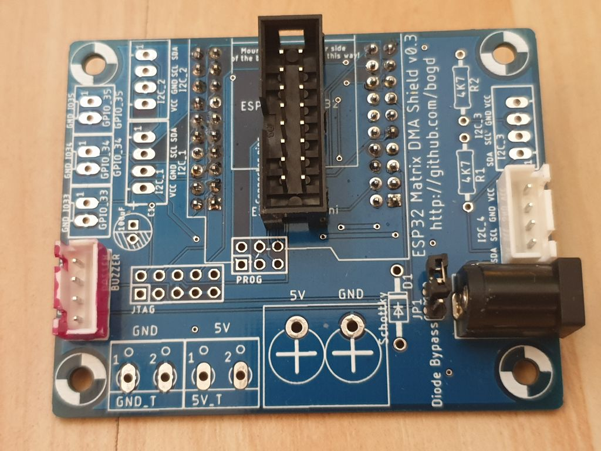
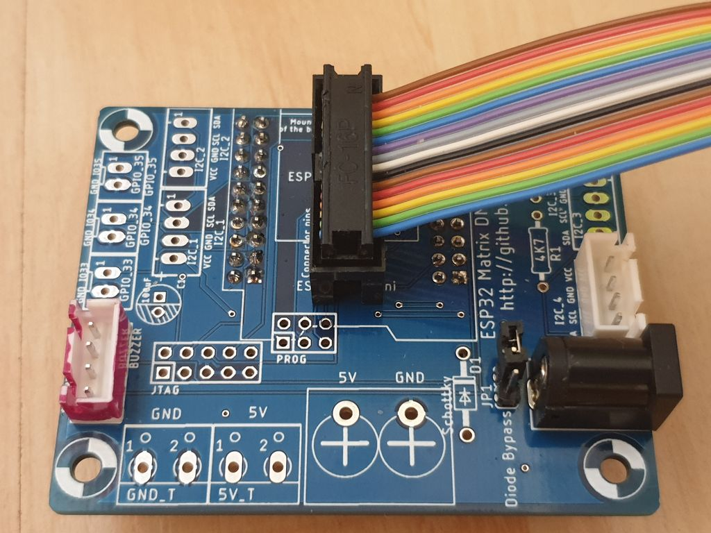
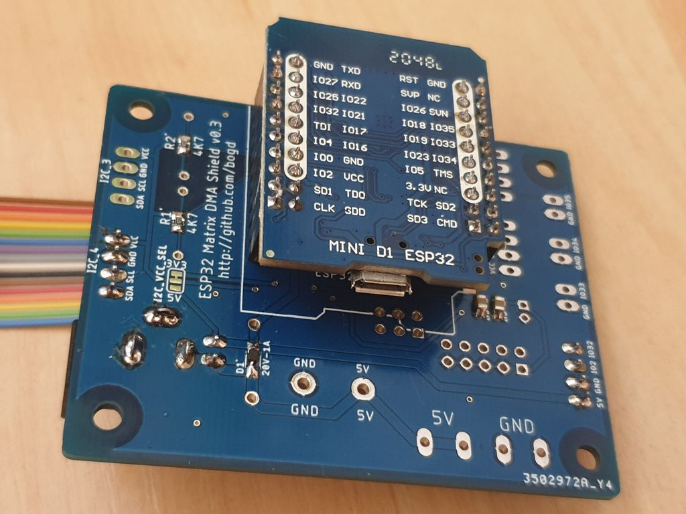

# ESP32 Morphing Clock Shield PCB

## Info

Features:
* 16-wire ribbon cable connection to the RGB matrix
* Mounting holes for securing the shield to the enclosure
* Options for both PTH and SMD (0805/SOD-323) parts for all parts
* Multiple JST-XH (2.54mm) connectors for I2C sensors and for GPIOs (use for push-buttons, for example)
* Exposed JTAG and PROG connectors, for use with debugging/programming via ESP32-Prog (although they are a bit too close together in v0.3 :) )

**WARNING!!** Do not use v0.1 of the boards! I have made several mistakes while designing them (reversed OE/LAT pins on the matrix connector, and put in a WAY too thin power supply trace). As a result, I was unable to get the ESP32 to even boot when connected to these boards.

v0.3 has been tested, and works reliably.

## Components

These are the components that you will need to populate the PCB:
* R1, R2 (I2C pull-up resistors) - 4k7 ohm, PTH or 0805 SMD
* C1,C2,C3 (decoupling capacitor(s)) - either 100uF PTH, or 2x47uF SMD
* D1 (protection diode, prevents the matrix from pulling too much power from your USB port) - any Schottky will work. For example: BAT85 (PTH), or 1N5819 (SOD-323)
* P1 - ribbon cable connector, 2x8 pin
* GND_T/5V_T - 2xScrew terminal blocks, 5.0mm
* power connection - 2.1/5.5mm PCB connector, or **7.62mm** screw terminal block
* I2C and GPIO connectors - JST-XH 2.54mm, 2 and 4-pin 

## Board 

Images of the completed board:

The board with (a minimum of) components soldered on:

Connected to the matrix and the ESP32 module:

## Schematic

